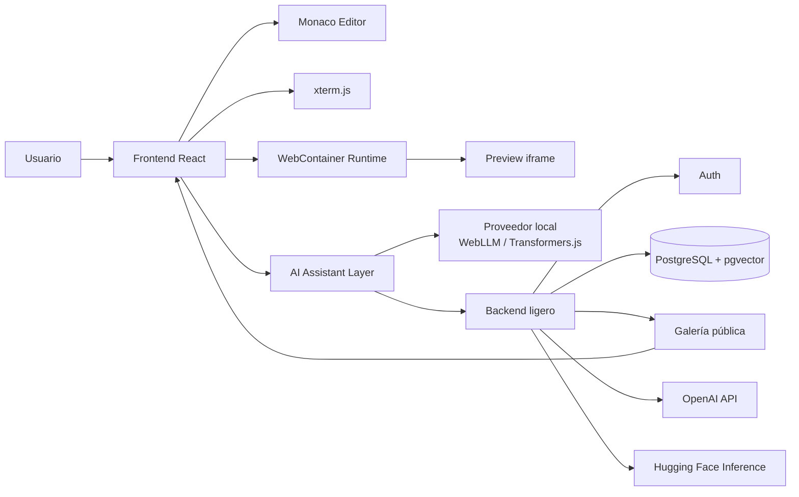
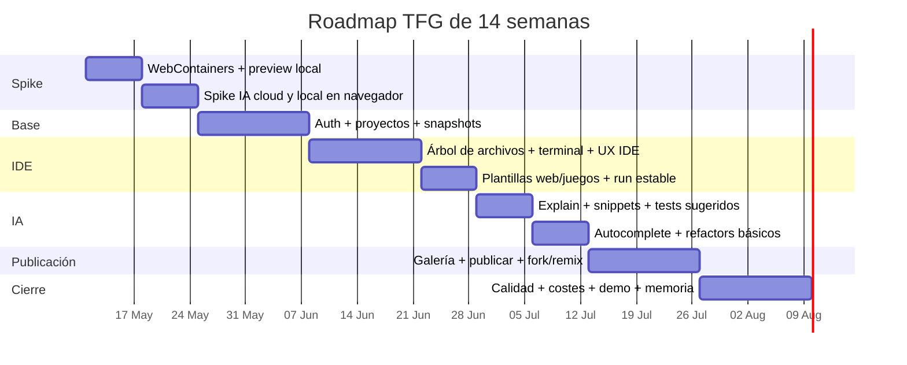

# IDE Web Colaborativo con asistente IA para TFG

## Resumen ejecutivo

Sí: **el proyecto es factible como TFG** si lo defines como una plataforma **desktop-first**, **Chromium-first**, orientada a **proyectos web y juegos basados en tecnologías web**, con **ejecución local en navegador como requisito obligatorio** y una capa de IA **modular**. La combinación que mejor encaja con ese objetivo hoy es **React + Monaco + xterm.js + WebContainers** para el núcleo del IDE, más un backend ligero para autenticación, persistencia, galería pública y proxy de IA cuando uses proveedores cloud. WebContainers está diseñado precisamente para ejecutar Node.js, sistema de ficheros y procesos dentro de la pestaña del navegador; Monaco proporciona el editor y APIs para inline completions, hovers y code actions; xterm.js aporta el terminal web. citeturn20view0turn15search0turn15search1turn15search2turn19view0

El punto clave de viabilidad es el alcance. El MVP recomendable no es “un VS Code completo en la web”, sino un **IDE browser-native para crear, guardar, ejecutar, publicar y reutilizar proyectos web** con asistencia IA para **autocompletado, snippets, explicación de código, refactorings básicos con vista previa y sugerencia de tests**. Esto es compatible con WebContainers, pero exige aceptar varias restricciones: cabeceras COOP/COEP, HTTPS, una única instancia de WebContainer por pestaña, compatibilidad plena sobre navegadores Chromium y limitaciones con addons nativos. Monaco, además, no soporta navegadores móviles y no ejecuta extensiones de VS Code “tal cual”. citeturn20view1turn20view2turn1view0turn20view3turn19view1

Mi veredicto final es este: **muy factible** si priorizas ejecución local vía WebContainers y tratas la IA como una abstracción con varios proveedores; **factible con riesgo controlado** si añades un fallback de IA local en navegador con WebLLM o Transformers.js; y **solo como Plan B** usaría Judge0 con ejecución server-side si el spike de semanas 1–2 demuestra un bloqueo real con WebContainers o con la IA local. Judge0 es potente y sandboxed, pero cambia el perfil del proyecto: pierdes parte del valor central de “todo local en navegador”. citeturn1view5turn20view0turn14view0turn13view2

## Factibilidad y veredicto

La parte más sólida del proyecto es el **runtime local**. WebContainers permite bootear un entorno Node.js en el navegador, montar archivos, ejecutar comandos como `npm install` o `npm run dev`, y capturar la URL de preview mediante el evento `server-ready`. Eso encaja de forma natural con plantillas de proyectos web y juegos hechos con herramientas modernas del ecosistema JS. Además, su documentación destaca ventajas importantes para un TFG: ejecución totalmente client-side, menor coste operativo, posibilidad de funcionamiento offline y reducción del riesgo asociado a ejecutar código de terceros en tus servidores. citeturn20view0turn20view2

La viabilidad baja cuando intentas salirte del ecosistema web/Node. WebContainers solo puede ejecutar lenguajes soportados nativamente en la web —JavaScript y WebAssembly— y no carga addons nativos salvo que se hayan recompilado a WASM. Eso significa que el TFG debe definirse con honestidad: **soporte de primera clase para HTML/CSS/JS/TS y proyectos frontend modernos**, no “IDE universal para cualquier lenguaje”. Si el tribunal valora la claridad de alcance, esto juega a tu favor. citeturn20view3

También hay restricciones de plataforma que conviene asumir desde el inicio. WebContainers requiere `SharedArrayBuffer` y, por tanto, aislamiento cross-origin con cabeceras COEP/COOP; además, la documentación oficial sigue dejando claro que el soporte más sólido es en **desktop Chromium**, mientras que Firefox está en **alpha** y Safari en **beta** para este caso de uso. Monaco tampoco soporta navegadores móviles. Dado que tú aceptas pobre compatibilidad no-Chromium, esta restricción no es un problema de concepto, sino una condición del producto. citeturn20view1turn1view0turn19view1

La parte de IA es técnicamente viable porque Monaco expone justo los puntos de enganche que necesitas: `registerInlineCompletionsProvider` para ghost text/autocompletado, `registerCodeActionProvider` para quick fixes y refactors básicos, y `registerHoverProvider` para explicaciones contextuales. La decisión importante no es “si se puede”, sino **dónde inferir**: en cloud mediante API, en navegador con WebGPU/WASM, o con un proveedor hosted intermedio. citeturn15search0turn15search1turn15search2

## Arquitectura propuesta

La arquitectura recomendable es **browser-heavy y backend-thin**: el frontend lleva el peso del editor, terminal, preview y ejecución; el backend solo hace autenticación, persistencia de proyectos/snapshots, galería pública, control de permisos y proxy seguro para IA cloud. Esto encaja con las recomendaciones de OpenAI de no exponer API keys en código cliente y con la naturaleza client-side de WebContainers. Para búsqueda de snippets, la opción más limpia es indexar embeddings en PostgreSQL con `pgvector`. citeturn18view0turn20view0turn24search0

La implementación recomendable del asistente IA es una **abstracción por capacidades**, no por proveedor. Es decir: `completeInline()`, `explainSelection()`, `generateSnippet()`, `suggestRefactor()`, `suggestTests()` y `searchSnippets()`. Así puedes conectar primero OpenAI vía backend proxy, después añadir WebLLM o Transformers.js como fallback local y, si hace falta, un proveedor hosted como Hugging Face Inference Providers sin reescribir la UI. OpenAI expone APIs REST/streaming y embeddings; WebLLM es compatible con la API de OpenAI y ejecuta modelos en navegador con WebGPU; Transformers.js corre directamente en navegador sobre ONNX Runtime Web, usando CPU/WASM por defecto y WebGPU de forma opcional. citeturn18view0turn5view2turn14view0turn13view2

La tabla siguiente resume tres familias de integración. **Latencia y coste** son estimaciones razonadas para un portátil moderno y conexión estable en Europa; **privacidad, offline y comercialidad** se apoyan en documentación oficial de cada ecosistema. citeturn18view0turn5view1turn13view0turn13view1turn13view2turn14view0turn13view3

| Opción IA | Latencia estimada | Coste estimado | Privacidad y datos | Integración con Monaco | Offline capability | Licencia y comercialidad |
|---|---:|---:|---|---|---|---|
| **API cloud** con OpenAI | ~0,7–3 s por acción corta | Bajo–medio, variable por tokens | El código sale a terceros; en API no se usa para entrenar por defecto, con retención de abuso por defecto de hasta 30 días | Muy buena para inline, chat, code actions y tests | No | Uso comercial bajo términos de API; requiere backend proxy |
| **Local WASM/WebGPU** con WebLLM o Transformers.js | ~1–10 s+ según modelo y dispositivo; primera carga más lenta | 0 € variable por llamada; coste “oculto” en CPU/GPU, RAM y descarga inicial | Máxima privacidad; el código puede quedarse en el navegador | Buena para explain/snippets/tests y aceptable para inline ligero | Sí, tras descarga y caché | La librería suele ser permisiva; **el modelo** puede no serlo |
| **Hosted inference** con Hugging Face Inference Providers | ~1–4 s, muy variable según proveedor/modelo | Variable; HF repercute el coste del proveedor sin markup | Código enviado al proveedor elegido o al routing de HF | Buena por SDK/HTTP unificado | No | Comercialidad condicionada por el proveedor y la licencia del modelo |

**Decisión recomendada para el TFG:** OpenAI como proveedor principal para calidad y simplicidad; embeddings para búsqueda semántica de snippets; WebLLM o Transformers.js como **fallback local opcional** para explicación y snippets offline/privados; y Hugging Face como capa de experimentación o multi-proveedor. No haría autocompletado remoto “en cada pulsación” desde el día uno: incluso herramientas comerciales como Windsurf documentan que sus sugerencias pasivas envían requests en cada keystroke, y eso puede convertirse rápidamente en el principal driver de coste. citeturn11view2turn5view0turn13view0

## Riesgos, costes y alternativas

El primer riesgo técnico es **compatibilidad**. WebContainers exige COOP/COEP, HTTPS y un navegador compatible; Firefox y Safari no tienen el mismo nivel de madurez que Chromium para este caso de uso. A eso se suma que Monaco no va a móvil. La mitigación correcta no es “ocultarlo”, sino **hacerlo explícito** en el producto: landing con requisitos, detector de compatibilidad al arrancar, y modo degradado de solo lectura si el runtime completo no puede bootear. citeturn20view1turn1view0turn19view1

El segundo riesgo es **compatibilidad de paquetes**. WebContainers permite Node.js y toolchains web, pero no addons nativos por defecto. Eso afecta a ciertos paquetes y elimina la fantasía de “instalar cualquier cosa de npm y que funcione igual que en tu máquina”. La mitigación es acotar plantillas soportadas, validar dependencias críticas pronto y documentar una lista de compatibilidad del MVP. citeturn20view3

El tercer riesgo es **coste y latencia de la IA**, sobre todo en autocompletado inline. OpenAI recomienda modelos mini para menor latencia y coste; por ejemplo, `gpt-5.4-mini` cuesta actualmente 0,75 USD por millón de tokens de entrada y 4,50 USD por millón de tokens de salida. Como orden de magnitud, **10.000 acciones de IA al mes** con un promedio de **1.000 tokens de entrada + 100 de salida** serían unos **12 USD/mes**; **100.000 acciones**, unos **120 USD/mes**. Para embeddings, OpenAI indica que `text-embedding-3-small` rinde aproximadamente **62.500 páginas por dólar** suponiendo ~800 tokens por página; por inferencia, indexar **10.000 snippets de 300 tokens** costaría alrededor de **0,06 USD**. citeturn18view1turn5view0turn5view2

La buena noticia es que, como la **ejecución del proyecto corre en el cliente**, el backend deja de pagar el coste de ejecutar código usuario. Eso hace que el coste estructural del MVP se parezca más al de una app web convencional con auth, DB y almacenamiento que al de un “cloud IDE” clásico. Si no abusas de la IA cloud, un MVP académico puede moverse en una horquilla baja; si añades autocompletado remoto intensivo, el gasto de IA pasa a dominar muy rápido. citeturn20view0turn5view0

En licencias y legal, hay cuatro puntos importantes. **WebContainers** no exige licencia comercial para prototipos o POCs, pero sí para uso productivo comercial. **Monaco** y **xterm.js** están bajo licencia MIT. **Judge0** está bajo GPL-3.0, lo cual no lo invalida para un TFG, pero sí debes tenerlo en cuenta si acabas modificándolo o distribuyéndolo en un producto real. Y con los **modelos locales**, la licencia no la define solo la librería: WebLLM es Apache-2.0, pero los pesos del modelo pueden venir con Apache-2.0, MIT, OpenRAIL, licencias no comerciales u otras; Hugging Face insiste en revisar y respetar la licencia declarada en la model card. citeturn1view1turn19view1turn19view0turn1view5turn14view0turn13view3

Para privacidad y cumplimiento, OpenAI documenta que los datos enviados a su API **no se usan para entrenar** por defecto, que por defecto existen **abuse monitoring logs** retenidos hasta **30 días**, y que puede firmar DPA y ofrecer controles enterprise. Además, OpenAI insiste en que la **API key nunca debe exponerse en cliente**, así que cualquier integración cloud necesita backend proxy. GitHub Copilot, por su parte, sigue siendo relevante como benchmark funcional, pero tiene implicaciones distintas: se entrena con código público y GitHub documenta que ciertas interacciones de usuarios individuales pueden usarse para entrenamiento salvo opt-out; a la vez, ofrece **code referencing** para identificar coincidencias con código público y planes Business/Enterprise con gestión de políticas e IP indemnity. Windsurf/Codeium ofrece zero-data retention por defecto en Teams/Enterprise y opciones self-hosted/hybrid, pero su documentación pública está más orientada a su propio producto y despliegue enterprise que a una integración embebida sencilla dentro de un IDE web de terceros. citeturn5view1turn25view0turn18view0turn10view0turn10view1turn11view0turn11view3

**Alternativas reales:** si quieres seguir siendo “local-first”, la única alternativa fuerte a WebContainers para el flujo principal es fragmentar por lenguaje y usar runtimes específicos en WASM, como Pyodide para Python; eso complica mucho el proyecto y lo separa del objetivo principal de publicar webs y juegos. **Plan B** práctico: Judge0 + backend execution, manteniendo Monaco/xterm/galería y dejando claro que has pivotado por limitaciones técnicas del runtime local. citeturn17search1turn1view5

## Specs.md

GitHub Spec Kit populariza un flujo **spec → plan → tasks** donde la especificación define el **qué** y el roadmap el **cómo/cuándo**. El contenido siguiente está redactado con esa lógica y alineado con las restricciones reales de WebContainers, Monaco y la integración IA comentadas arriba. citeturn26search3turn20view0turn19view1turn18view0

**Estado:** borrador v2 para TFG.

**Resumen ejecutivo:** plataforma web para crear, editar, ejecutar localmente y publicar proyectos web/juegos en el navegador, con asistente IA integrado para ayuda de código. El producto es desktop-first, Chromium-first y no incluye coedición en tiempo real.

**Veredicto de factibilidad:** factible como TFG si el alcance del MVP se limita a proyectos compatibles con ejecución local en navegador y si la IA se diseña como un módulo desacoplado con proveedores intercambiables.

**Decisiones de arquitectura:**
- Ejecución local en navegador: **MUST**.
- Dominio principal: proyectos HTML/CSS/JS/TS y plantillas web/juegos basadas en toolchains web.
- Frontend: React + Monaco + xterm + preview embebida.
- Runtime: WebContainers.
- Backend: auth, persistencia, galería, métricas y proxy seguro de IA.
- IA: arquitectura por capacidades con soporte para OpenAI, local WebLLM/Transformers.js y hosted inference opcional.
- Sin coedición real-time.

**RF**
- **RF-001** Registro, login y logout.
- **RF-002** Crear proyecto desde plantilla.
- **RF-003** Editor multiarchivo con árbol de archivos.
- **RF-004** Guardado persistente de snapshots.
- **RF-005** Ejecutar el proyecto **localmente en navegador**.
- **RF-006** Mostrar preview embebida para webs/juegos publicados por el runtime local.
- **RF-007** Mostrar terminal/logs de ejecución.
- **RF-008** Publicar proyecto en modo privado o público.
- **RF-009** Galería de proyectos públicos con vista y ejecución.
- **RF-010** Fork/remix de proyectos públicos.
- **RF-011** Autocompletado IA inline.
- **RF-012** Generación de snippets a partir de prompt o comentario.
- **RF-013** Explicación de código seleccionado.
- **RF-014** Refactorings básicos asistidos por IA con preview antes de aplicar.
- **RF-015** Sugerencia de tests a partir del archivo o función actual.
- **RF-016** Búsqueda de snippets por texto y, opcionalmente, por embeddings.
- **RF-017** Selección/configuración del proveedor IA si existe más de uno.
- **RF-018** Detección de navegador incompatible y mensaje explícito.
- **RF-019** Degradación elegante cuando la IA no esté disponible.

**RNF**
- **RNF-001** Desktop-first; Chromium es plataforma objetivo primaria.
- **RNF-002** El MVP no depende de ejecución server-side para correr proyectos del flujo principal.
- **RNF-003** Ninguna API key de IA puede exponerse en cliente.
- **RNF-004** El sistema debe permitir presupuestar y limitar el coste IA.
- **RNF-005** Las acciones IA que modifiquen código deben ser revisables antes de aplicarse.
- **RNF-006** Los proyectos guardados deben recuperar estructura y contenido sin pérdida.
- **RNF-007** La UI debe separar con claridad editor, preview, terminal y panel IA.
- **RNF-008** Deben registrarse errores de guardado, ejecución e IA.

**Entidades**
- Usuario
- Proyecto
- Snapshot
- Publicación
- Plantilla
- EjecuciónLocal
- InteracciónIA
- SnippetIndex
- Fork

**Criterios de aceptación medibles**
- En un navegador Chromium compatible, una persona usuaria autenticada puede crear un proyecto desde plantilla, ejecutarlo y ver preview sin que el backend ejecute su código.
- El proyecto se puede cerrar y recuperar en otra sesión con la misma estructura de archivos.
- Un visitante puede abrir una URL pública, cargar el proyecto y crear un fork/remix.
- La IA puede completar al menos una sugerencia inline, generar un snippet, explicar una selección y proponer un refactor básico con preview.
- En navegador no compatible, el sistema muestra una advertencia antes de intentar bootear el runtime completo.

**Escenarios de aceptación**
- **Escenario A:** crear proyecto → editar → ejecutar → preview → guardar → recuperar.
- **Escenario B:** publicar proyecto → abrir URL pública → ejecutar → forkar.
- **Escenario C:** seleccionar función → pedir explicación → recibir respuesta con referencia al contexto.
- **Escenario D:** seleccionar bloque → pedir refactor → ver diff/patch → aceptar o cancelar.
- **Escenario E:** abrir en navegador no compatible → ver limitación clara y no interfaz rota.

**Riesgos y mitigaciones**
- Compatibilidad no-Chromium: detector y plataforma objetivo explícita.
- Dependencias incompatibles con WebContainers: plantillas curadas y validación temprana.
- Coste IA: límites por usuario, debounce y uso preferente de modelos mini.
- Latencia IA local: usarla como opción/fallback y no como único camino del MVP.
- Riesgo legal de modelos locales: whitelist de modelos/licencias aprobadas.

## RoadMap.md

Este roadmap de 14 semanas prioriza primero los dos riesgos que pueden matar el proyecto: **ejecución local** e **IA útil**. Si ambos spikes salen bien, el resto es ingeniería de producto relativamente estándar. Si alguno falla, el **pivot plan** preserva el máximo valor posible del TFG. citeturn20view2turn14view0turn13view2turn1view5

**Semanas 1–2: spike técnico obligatorio**
- Probar Monaco + árbol virtual + snapshots.
- Bootear WebContainer una sola vez por pestaña.
- Montar plantilla base y lanzar preview.
- Conectar xterm a salida de procesos.
- Integrar una acción IA cloud vía backend proxy.
- Integrar una acción IA local con WebLLM o Transformers.js en worker.
- Medir: tiempo de boot, tiempo a preview y tiempo a primera respuesta IA.
- **Salida:** demo mínima con editor, ejecución local, preview y una acción IA.
- **Pivot trigger:** si WebContainers no es estable o la IA local es inviable en el hardware objetivo.

**Semanas 3–4: base de producto**
- Auth.
- CRUD de proyectos.
- Persistencia de snapshots.
- Proyectos privados por defecto.
- Modelo de publicación pública.
- **Salida:** flujo completo crear/guardar/abrir.

**Semanas 5–6: IDE utilizable**
- Árbol de archivos sólido.
- Terminal visible.
- Botón Run/Stop/Reset.
- Preview embebida estable.
- Mensajes de compatibilidad y errores comprensibles.
- Plantillas iniciales: web vanilla, React y una plantilla orientada a juego web.
- **Salida:** demo del núcleo del IDE sin IA.

**Semanas 7–8: IA MVP**
- Panel IA lateral.
- Explain code.
- Generate snippet.
- Suggest tests.
- Inline autocomplete con límites de coste.
- Refactors básicos con preview y confirmación.
- **Salida:** los cinco casos IA exigidos por la spec.

**Semanas 9–10: publicación y galería**
- Página pública de proyecto.
- Galería/listado.
- Fork/remix.
- Metadatos mínimos.
- **Salida:** visitante abre, ejecuta y remixa.

**Semanas 11–12: búsqueda semántica y endurecimiento**
- Índice de snippets.
- Búsqueda por embeddings si entra en tiempo.
- Logs, métricas y presupuesto IA.
- Hardening de errores y estados vacíos.
- **Salida:** experiencia demo-ready.

**Semanas 13–14: validación final**
- Testing de flujos críticos.
- Script de demo.
- Memoria técnica y capturas.
- Revisión de licencias/modelos aprobados.
- Buffer de corrección.
- **Salida:** despliegue final y defensa preparada.

**Pivot plan**
- **Plan B ejecución:** Judge0 + backend execution si WebContainers falla. Mantener editor, persistencia, galería e IA. Documentar explícitamente que se ha sacrificado el requisito ideal de ejecución 100 % local.
- **Plan B IA local:** dejar WebLLM/Transformers.js fuera del MVP y mantener OpenAI/HF vía backend, con opción local documentada como trabajo futuro.
- **Plan B embeddings:** búsqueda textual primero; embeddings después.

**Entregables**
- Demo del spike.
- MVP del IDE.
- MVP IA.
- Publicación/galería.
- Despliegue final.
- Memoria técnica con decisiones, métricas y límites.

## Referencias oficiales

- WebContainers Introduction — `https://webcontainers.io/guides/introduction`
- WebContainers Quickstart — `https://webcontainers.io/guides/quickstart`
- WebContainers Browser Support — `https://webcontainers.io/guides/browser-support`
- WebContainers Configuring Headers — `https://webcontainers.io/guides/configuring-headers`
- WebContainers API Reference — `https://webcontainers.io/api`
- WebContainers Commercial Usage — `https://webcontainers.io/enterprise`
- Monaco Editor — `https://microsoft.github.io/monaco-editor/`
- Monaco Editor API — `https://microsoft.github.io/monaco-editor/typedoc/`
- Monaco Editor GitHub — `https://github.com/microsoft/monaco-editor`
- xterm.js Docs — `https://xtermjs.org/docs/`
- xterm.js GitHub — `https://github.com/xtermjs/xterm.js`
- OpenAI API Overview — `https://developers.openai.com/api/reference/overview`
- OpenAI Models — `https://developers.openai.com/api/docs/models`
- OpenAI Pricing — `https://openai.com/api/pricing/`
- OpenAI Data Controls — `https://developers.openai.com/api/docs/guides/your-data`
- OpenAI Embeddings Guide — `https://developers.openai.com/api/docs/guides/embeddings`
- OpenAI Enterprise Privacy — `https://openai.com/enterprise-privacy/`
- Hugging Face Inference Providers — `https://huggingface.co/docs/inference-providers/en/index`
- Hugging Face Inference Pricing — `https://huggingface.co/docs/inference-providers/en/pricing`
- Transformers.js — `https://huggingface.co/docs/transformers.js/index`
- Hugging Face Licenses — `https://huggingface.co/docs/hub/en/repositories-licenses`
- WebLLM — `https://webllm.mlc.ai/`
- WebLLM GitHub — `https://github.com/mlc-ai/web-llm`
- pgvector — `https://github.com/pgvector/pgvector`
- Judge0 — `https://github.com/judge0/judge0`
- GitHub Copilot Plans — `https://github.com/features/copilot/plans`
- GitHub Copilot Code Referencing — `https://docs.github.com/en/copilot/concepts/completions/code-referencing`
- Windsurf Security — `https://windsurf.com/security`
- GitHub Spec Kit — `https://github.github.com/spec-kit/`